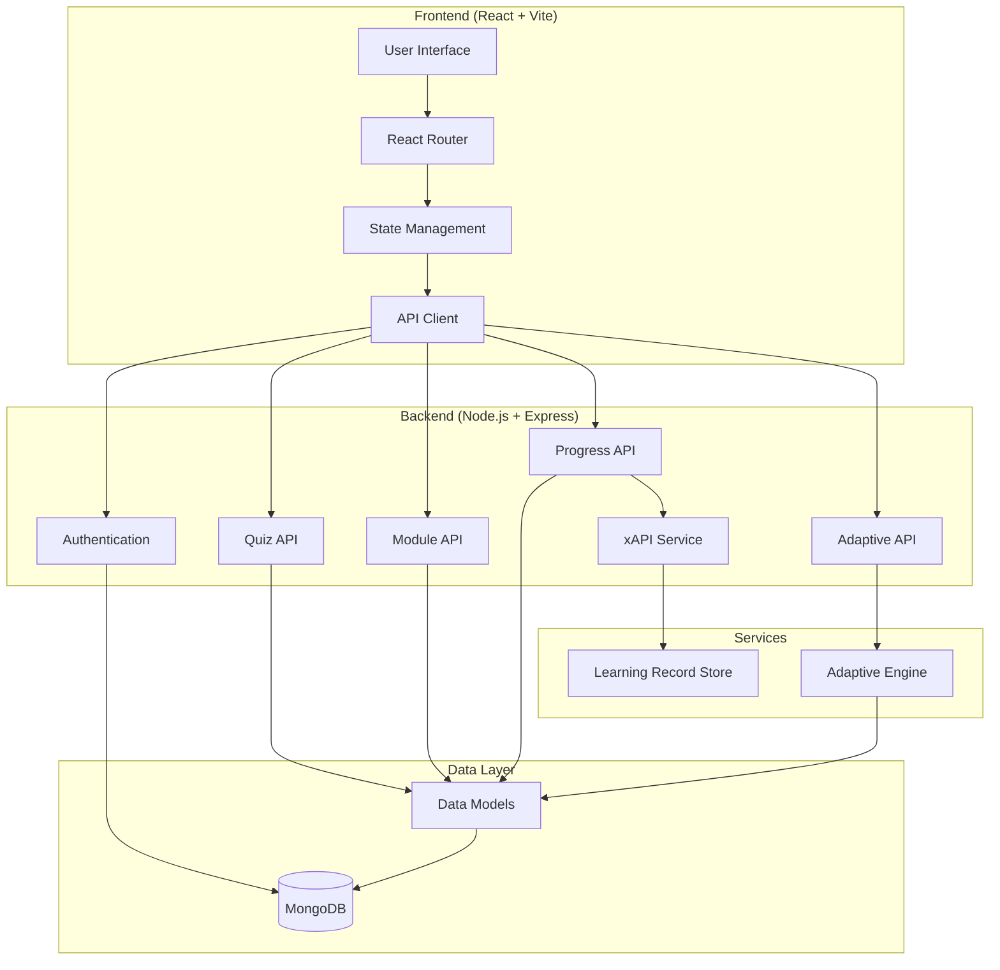

# Adaptive E-Learning Platform

A full-stack web application for adaptive e-learning that personalizes content based on student performance, response times, and mastery levels.

## 🚀 Features

- **Adaptive Learning**: Dynamic difficulty adjustment based on performance
- **JWT Authentication**: Secure user registration and login
- **xAPI Integration**: Learning analytics tracking with Learning Record Store
- **Real-time Progress**: Track student performance and response times
- **Modern UI**: Responsive design with Tailwind CSS
- **TypeScript**: Full type safety across frontend and backend

## 🛠 Tech Stack

### Backend
- **Runtime**: Node.js 18+ with TypeScript
- **Framework**: Express.js
- **Database**: MongoDB with Mongoose ODM
- **Authentication**: JWT with bcrypt password hashing
- **Validation**: Joi schema validation
- **Logging**: Winston
- **Testing**: Jest

### Frontend
- **Framework**: React 18+ with TypeScript
- **Build Tool**: Vite
- **Styling**: Tailwind CSS
- **State Management**: React Context + Zustand
- **Routing**: React Router v6
- **Charts**: Recharts
- **Testing**: Jest + React Testing Library

### DevOps
- **Containerization**: Docker + Docker Compose
- **CI/CD**: GitHub Actions
- **Code Quality**: ESLint + Prettier + Husky

## 🏗 Architecture



## 📁 Project Structure

```
adaptive-elearning/
├── client/                 # React frontend
│   ├── src/
│   │   ├── components/     # React components
│   │   ├── pages/         # Page components
│   │   ├── hooks/         # Custom hooks
│   │   ├── services/      # API services
│   │   ├── store/         # State management
│   │   ├── types/         # TypeScript types
│   │   └── utils/         # Utility functions
│   ├── public/            # Static assets
│   └── tests/             # Frontend tests
├── server/                # Node.js backend
│   ├── src/
│   │   ├── controllers/   # Route controllers
│   │   ├── middleware/    # Express middleware
│   │   ├── models/        # Mongoose models
│   │   ├── routes/        # API routes
│   │   ├── services/      # Business logic
│   │   ├── utils/         # Utility functions
│   │   └── types/         # TypeScript types
│   └── tests/             # Backend tests
├── shared/                # Shared types and utilities
├── docs/                  # Documentation
├── scripts/               # Build and deployment scripts
└── docker/                # Docker configuration
```

## 🚀 Quick Start

### Prerequisites
- Node.js 18+
- MongoDB 6+
- Docker & Docker Compose (optional)

### Installation

1. **Clone and install dependencies:**
```bash
git clone <repository-url>
cd adaptive-elearning

# Install backend dependencies
cd server && npm install

# Install frontend dependencies
cd ../client && npm install

# Install shared dependencies
cd ../shared && npm install
```

2. **Environment setup:**
```bash
# Copy environment files
cp server/.env.example server/.env
cp client/.env.example client/.env

# Edit environment variables
nano server/.env
nano client/.env
```

3. **Database setup:**
```bash
# Start MongoDB (if using Docker)
docker-compose up -d mongodb

# Or start MongoDB locally
mongod
```

4. **Run development servers:**
```bash
# Terminal 1: Start backend
cd server && npm run dev

# Terminal 2: Start frontend
cd client && npm run dev
```

5. **Access the application:**
- Frontend: http://localhost:5173
- Backend API: http://localhost:3000
- API Documentation: http://localhost:3000/api-docs

### Docker Deployment

```bash
# Build and run with Docker Compose
docker-compose up --build

# Run in background
docker-compose up -d
```

## 🧪 Testing

```bash
# Run all tests
npm run test

# Run backend tests
cd server && npm test

# Run frontend tests
cd client && npm test

# Run tests with coverage
npm run test:coverage
```

## 📚 Documentation

- [Developer Guide](./docs/developer.md) - Technical documentation
- [User Guide](./docs/user-guide.md) - End-user documentation
- [API Reference](./docs/openapi.yaml) - OpenAPI specification

## 🤝 Contributing

1. Fork the repository
2. Create a feature branch (`git checkout -b feature/amazing-feature`)
3. Commit your changes (`git commit -m 'Add amazing feature'`)
4. Push to the branch (`git push origin feature/amazing-feature`)
5. Open a Pull Request

## 📄 License

This project is licensed under the MIT License - see the [LICENSE](LICENSE) file for details.

## 🆘 Support

For support and questions:
- Create an issue in the repository
- Check the [documentation](./docs/)
- Review the [FAQ](./docs/faq.md) 