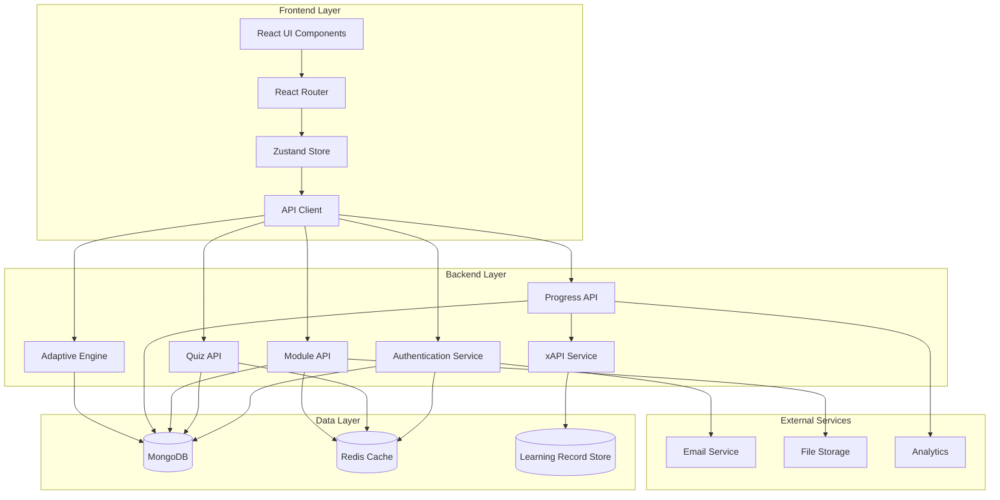

# Developer Documentation - Adaptive E-Learning Platform

## Table of Contents

1. [System Architecture](#system-architecture)
2. [API Reference](#api-reference)
3. [Database Schema](#database-schema)
4. [Adaptive Learning Algorithm](#adaptive-learning-algorithm)
5. [xAPI Integration](#xapi-integration)
6. [Development Setup](#development-setup)
7. [Testing Strategy](#testing-strategy)
8. [Deployment Guide](#deployment-guide)
9. [Code Standards](#code-standards)

## System Architecture

### Overview

The Adaptive E-Learning Platform follows a modern full-stack architecture with:

- **Frontend**: React 18+ with TypeScript, Vite, Tailwind CSS
- **Backend**: Node.js with Express, TypeScript, MongoDB
- **State Management**: Zustand for client-side state
- **Authentication**: JWT with refresh tokens
- **Database**: MongoDB with Mongoose ODM
- **Real-time**: WebSocket support for live updates
- **Analytics**: xAPI integration for learning analytics

### Architecture Diagram



### Key Components

#### Frontend Components
- **Layout**: Main application wrapper with navigation
- **ProtectedRoute**: Route protection with authentication
- **AuthStore**: Authentication state management
- **API Client**: HTTP client with interceptors
- **Form Components**: Reusable form elements
- **Chart Components**: Progress visualization

#### Backend Services
- **Authentication Service**: JWT token management
- **Adaptive Engine**: Learning path optimization
- **xAPI Service**: Learning analytics tracking
- **Quiz Service**: Assessment management
- **Module Service**: Content management
- **Progress Service**: Learning progress tracking

## API Reference

### Authentication Endpoints

#### POST /api/auth/register
Register a new user account.

**Request Body:**
```json
{
  "email": "user@example.com",
  "password": "securePassword123",
  "firstName": "John",
  "lastName": "Doe",
  "role": "student"
}
```

**Response:**
```json
{
  "success": true,
  "data": {
    "user": {
      "id": "user_id",
      "email": "user@example.com",
      "firstName": "John",
      "lastName": "Doe",
      "role": "student"
    },
    "tokens": {
      "accessToken": "jwt_token",
      "refreshToken": "refresh_token"
    }
  }
}
```

#### POST /api/auth/login
Authenticate user and return tokens.

**Request Body:**
```json
{
  "email": "user@example.com",
  "password": "securePassword123"
}
```

#### POST /api/auth/refresh
Refresh access token using refresh token.

**Headers:**
```
Authorization: Bearer refresh_token
```

#### GET /api/auth/profile
Get current user profile.

**Headers:**
```
Authorization: Bearer access_token
```

### Quiz Endpoints

#### GET /api/quizzes
Get available quizzes with pagination.

**Query Parameters:**
- `page`: Page number (default: 1)
- `limit`: Items per page (default: 10)
- `difficulty`: Filter by difficulty level
- `subject`: Filter by subject

#### GET /api/quizzes/:id
Get specific quiz details.

#### POST /api/quizzes/:id/submit
Submit quiz answers.

**Request Body:**
```json
{
  "answers": [
    {
      "questionId": "question_id",
      "answer": "selected_answer",
      "timeSpent": 45
    }
  ]
}
```

### Module Endpoints

#### GET /api/modules
Get available learning modules.

#### GET /api/modules/:id
Get specific module content.

#### POST /api/modules/:id/progress
Update module progress.

**Request Body:**
```json
{
  "completedSections": ["section1", "section2"],
  "timeSpent": 1200,
  "completed": false
}
```

### Progress Endpoints

#### GET /api/progress
Get user learning progress.

#### GET /api/progress/analytics
Get detailed progress analytics.

### Adaptive Endpoints

#### GET /api/adaptive/recommendations
Get personalized content recommendations.

#### GET /api/adaptive/learning-path
Get optimized learning path.

## Database Schema

### User Model

```typescript
interface User {
  _id: ObjectId;
  email: string;
  password: string;
  firstName: string;
  lastName: string;
  role: 'student' | 'instructor' | 'admin';
  profile: {
    avatar?: string;
    bio?: string;
    preferences: {
      difficulty: 'beginner' | 'intermediate' | 'advanced';
      learningStyle: 'visual' | 'auditory' | 'kinesthetic';
      timeZone: string;
    };
  };
  stats: {
    totalTimeSpent: number;
    quizzesCompleted: number;
    modulesCompleted: number;
    averageScore: number;
    streakDays: number;
  };
  createdAt: Date;
  updatedAt: Date;
}
```

### Quiz Model

```typescript
interface Quiz {
  _id: ObjectId;
  title: string;
  description: string;
  subject: string;
  difficulty: 'beginner' | 'intermediate' | 'advanced';
  questions: Question[];
  timeLimit?: number;
  passingScore: number;
  tags: string[];
  isActive: boolean;
  createdBy: ObjectId;
  createdAt: Date;
  updatedAt: Date;
}

interface Question {
  _id: ObjectId;
  text: string;
  type: 'multiple-choice' | 'true-false' | 'fill-blank' | 'essay';
  options?: string[];
  correctAnswer: string | string[];
  explanation?: string;
  difficulty: number;
  tags: string[];
}
```

### Module Model

```typescript
interface Module {
  _id: ObjectId;
  title: string;
  description: string;
  subject: string;
  difficulty: 'beginner' | 'intermediate' | 'advanced';
  content: ModuleContent[];
  prerequisites: ObjectId[];
  estimatedDuration: number;
  tags: string[];
  isActive: boolean;
  createdBy: ObjectId;
  createdAt: Date;
  updatedAt: Date;
}

interface ModuleContent {
  _id: ObjectId;
  type: 'text' | 'video' | 'interactive' | 'assessment';
  title: string;
  content: any;
  order: number;
  duration?: number;
}
```

### Progress Model

```typescript
interface Progress {
  _id: ObjectId;
  userId: ObjectId;
  moduleId?: ObjectId;
  quizId?: ObjectId;
  type: 'module' | 'quiz';
  status: 'in-progress' | 'completed' | 'failed';
  score?: number;
  timeSpent: number;
  completedSections: string[];
  attempts: number;
  lastAttemptAt: Date;
  masteryLevel: number;
  confidenceScore: number;
  createdAt: Date;
  updatedAt: Date;
}
```

## Adaptive Learning Algorithm

### Difficulty Calculation

The adaptive engine calculates question difficulty using:

```typescript
function calculateDifficulty(
  correctAnswers: number,
  totalAnswers: number,
  averageTime: number,
  targetTime: number
): number {
  const accuracy = correctAnswers / totalAnswers;
  const timeRatio = averageTime / targetTime;
  
  // Base difficulty from accuracy
  let difficulty = accuracy * 10;
  
  // Adjust based on time performance
  if (timeRatio < 0.7) difficulty += 2; // Too fast, increase difficulty
  if (timeRatio > 1.3) difficulty -= 1; // Too slow, decrease difficulty
  
  return Math.max(1, Math.min(10, difficulty));
}
```

### Mastery Level Calculation

```typescript
function calculateMasteryLevel(
  recentScores: number[],
  timeSpent: number[],
  attempts: number
): number {
  const averageScore = recentScores.reduce((a, b) => a + b, 0) / recentScores.length;
  const averageTime = timeSpent.reduce((a, b) => a + b, 0) / timeSpent.length;
  
  let mastery = averageScore / 100;
  
  // Penalize for too many attempts
  if (attempts > 3) mastery *= 0.9;
  
  // Bonus for consistent performance
  const consistency = 1 - (Math.std(recentScores) / 100);
  mastery *= (0.8 + 0.2 * consistency);
  
  return Math.min(1, Math.max(0, mastery));
}
```

### Learning Path Optimization

```typescript
function generateLearningPath(
  userProgress: Progress[],
  availableModules: Module[],
  userPreferences: UserPreferences
): Module[] {
  // Calculate current skill level
  const skillLevel = calculateSkillLevel(userProgress);
  
  // Filter modules by difficulty and prerequisites
  const suitableModules = availableModules.filter(module => {
    return module.difficulty <= skillLevel + 1 &&
           prerequisitesMet(module.prerequisites, userProgress);
  });
  
  // Sort by relevance and difficulty
  return suitableModules.sort((a, b) => {
    const relevanceA = calculateRelevance(a, userPreferences);
    const relevanceB = calculateRelevance(b, userPreferences);
    
    if (Math.abs(relevanceA - relevanceB) < 0.1) {
      return a.difficulty - b.difficulty;
    }
    
    return relevanceB - relevanceA;
  });
}
```

## xAPI Integration

### Statement Structure

```typescript
interface xAPIStatement {
  actor: {
    objectType: 'Agent';
    name: string;
    mbox: string;
  };
  verb: {
    id: string;
    display: {
      'en-US': string;
    };
  };
  object: {
    objectType: 'Activity';
    id: string;
    definition: {
      name: {
        'en-US': string;
      };
      description?: {
        'en-US': string;
      };
      type: string;
    };
  };
  result?: {
    score?: {
      raw: number;
      min: number;
      max: number;
      scaled: number;
    };
    success?: boolean;
    completion?: boolean;
    duration?: string;
    response?: string;
  };
  context?: {
    contextActivities?: {
      category?: Array<{ id: string }>;
      parent?: Array<{ id: string }>;
    };
    extensions?: Record<string, any>;
  };
  timestamp: string;
}
```

### Supported Verbs

- **answered**: User answered a quiz question
- **completed**: User completed a module or quiz
- **experienced**: User viewed learning content
- **attempted**: User started a quiz
- **bookmarked**: User bookmarked content
- **commented**: User added a comment

### Implementation Example

```typescript
async function sendQuizCompletionStatement(
  userId: string,
  quizId: string,
  score: number,
  timeSpent: number
): Promise<void> {
  const user = await User.findById(userId);
  const quiz = await Quiz.findById(quizId);
  
  const statement: xAPIStatement = {
    actor: {
      objectType: 'Agent',
      name: `${user.firstName} ${user.lastName}`,
      mbox: `mailto:${user.email}`
    },
    verb: {
      id: 'http://adlnet.gov/expapi/verbs/completed',
      display: {
        'en-US': 'completed'
      }
    },
    object: {
      objectType: 'Activity',
      id: `http://adaptive-elearning.com/quiz/${quizId}`,
      definition: {
        name: {
          'en-US': quiz.title
        },
        description: {
          'en-US': quiz.description
        },
        type: 'http://adlnet.gov/expapi/activities/assessment'
      }
    },
    result: {
      score: {
        raw: score,
        min: 0,
        max: 100,
        scaled: score / 100
      },
      success: score >= quiz.passingScore,
      completion: true,
      duration: `PT${Math.floor(timeSpent / 60)}M${timeSpent % 60}S`
    },
    timestamp: new Date().toISOString()
  };
  
  await xAPIService.sendStatement(statement);
}
```

## Development Setup

### Prerequisites

- Node.js 18+
- MongoDB 6+
- Redis (optional, for caching)
- Git

### Local Development

1. **Clone Repository**
```bash
git clone <repository-url>
cd adaptive-elearning
```

2. **Install Dependencies**
```bash
# Backend
cd server && npm install

# Frontend
cd ../client && npm install

# Shared
cd ../shared && npm install
```

3. **Environment Setup**
```bash
# Copy environment files
cp server/.env.example server/.env
cp client/.env.example client/.env

# Edit environment variables
nano server/.env
nano client/.env
```

4. **Database Setup**
```bash
# Start MongoDB
mongod

# Or use Docker
docker run -d -p 27017:27017 --name mongodb mongo:6
```

5. **Start Development Servers**
```bash
# Terminal 1: Backend
cd server && npm run dev

# Terminal 2: Frontend
cd client && npm run dev
```

### Environment Variables

#### Backend (.env)
```env
# Server
PORT=3000
NODE_ENV=development

# Database
MONGODB_URI=mongodb://localhost:27017/adaptive_elearning

# JWT
JWT_SECRET=your-super-secret-jwt-key
JWT_REFRESH_SECRET=your-super-secret-refresh-key
JWT_EXPIRES_IN=15m
JWT_REFRESH_EXPIRES_IN=7d

# Rate Limiting
RATE_LIMIT_WINDOW_MS=900000
RATE_LIMIT_MAX_REQUESTS=100

# CORS
CORS_ORIGIN=http://localhost:5173

# xAPI
XAPI_ENDPOINT=http://localhost:8080/xapi
XAPI_USERNAME=your-lrs-username
XAPI_PASSWORD=your-lrs-password

# Redis (optional)
REDIS_URL=redis://localhost:6379
```

#### Frontend (.env)
```env
VITE_API_URL=http://localhost:3000/api
VITE_APP_NAME=Adaptive E-Learning
VITE_APP_VERSION=1.0.0
```

## Testing Strategy

### Backend Testing

#### Unit Tests
```bash
cd server && npm test
```

#### Integration Tests
```bash
cd server && npm run test:integration
```

#### API Tests
```bash
cd server && npm run test:api
```

### Frontend Testing

#### Component Tests
```bash
cd client && npm test
```

#### E2E Tests
```bash
cd client && npm run test:e2e
```

### Test Coverage

```bash
# Backend coverage
cd server && npm run test:coverage

# Frontend coverage
cd client && npm run test:coverage
```

### Testing Best Practices

1. **Unit Tests**: Test individual functions and methods
2. **Integration Tests**: Test API endpoints and database operations
3. **Component Tests**: Test React components in isolation
4. **E2E Tests**: Test complete user workflows
5. **Mock External Services**: Use mocks for external APIs
6. **Test Data**: Use factories for consistent test data

## Deployment Guide

### Production Environment

#### Backend Deployment

1. **Build Application**
```bash
cd server
npm run build
```

2. **Environment Setup**
```bash
# Set production environment variables
export NODE_ENV=production
export MONGODB_URI=mongodb://production-db:27017/adaptive_elearning
export JWT_SECRET=production-jwt-secret
```

3. **Start Application**
```bash
npm start
```

#### Frontend Deployment

1. **Build Application**
```bash
cd client
npm run build
```

2. **Serve Static Files**
```bash
# Using nginx
sudo cp -r dist/* /var/www/html/

# Using serve
npx serve -s dist -l 3000
```

### Docker Deployment

```bash
# Build and run with Docker Compose
docker-compose -f docker-compose.prod.yml up --build -d

# Scale services
docker-compose -f docker-compose.prod.yml up --scale server=3 -d
```

### CI/CD Pipeline

#### GitHub Actions Example

```yaml
name: Deploy to Production

on:
  push:
    branches: [main]

jobs:
  test:
    runs-on: ubuntu-latest
    steps:
      - uses: actions/checkout@v3
      - uses: actions/setup-node@v3
        with:
          node-version: '18'
      - run: npm ci
      - run: npm test
      - run: npm run build

  deploy:
    needs: test
    runs-on: ubuntu-latest
    steps:
      - uses: actions/checkout@v3
      - name: Deploy to server
        run: |
          # Deployment commands
```

## Code Standards

### TypeScript

- Use strict mode
- Prefer interfaces over types
- Use meaningful type names
- Avoid `any` type
- Use generics when appropriate

### React

- Use functional components with hooks
- Prefer composition over inheritance
- Use TypeScript for props
- Keep components small and focused
- Use React.memo for performance

### Backend

- Use async/await over callbacks
- Implement proper error handling
- Use middleware for cross-cutting concerns
- Validate input data
- Use environment variables for configuration

### Database

- Use indexes for frequently queried fields
- Implement proper validation
- Use transactions for data consistency
- Implement soft deletes
- Use aggregation for complex queries

### Testing

- Write tests for all business logic
- Use descriptive test names
- Follow AAA pattern (Arrange, Act, Assert)
- Mock external dependencies
- Maintain test data factories

### Git

- Use conventional commits
- Keep commits small and focused
- Write meaningful commit messages
- Use feature branches
- Review code before merging

### Documentation

- Document all public APIs
- Use JSDoc for functions
- Keep README up to date
- Document environment variables
- Include setup instructions 